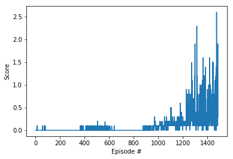
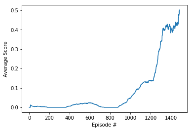

## Learning Algorithm

The agent is trained with the [Multi Agent DDPG](https://arxiv.org/abs/1706.02275). The full algorithm is described in the METHODS section of the paper.

The information flow in a MADDPG algorithm is depeicted below (Screenshot from the paper)


## Parameters

BUFFER_SIZE = int(1e5)  # replay buffer size
BATCH_SIZE = 250         # minibatch size
GAMMA = 0.99            # discount factor
TAU = 1e-3              # for soft update of target parameters
LR_ACTOR = 1e-4         # learning rate of the actor
LR_CRITIC = 1e-3        # learning rate of the critic 2539
WEIGHT_DECAY = 0        # L2 weight decay

## Architecture

Actor

- 2 fully connected layers with 200 and 150 units each

Critic

- 2 fully connected layers with 200 and 150 units each

ReplayBuffer

- A fixed size buffer of size 1e5

**Architecture of Neural Network for the Q-function**

- input size = 37
- output size = 4
- 2 hidden layers and one output layer
- each hidden layer has 64 hidden units and is followed by a `ReLU` activation layer
- output layer is followed by a linear activation layer

## Plot of Rewards

```
Episode 100	Average score: 0.005
Episode 200	Average score: 0.000
Episode 300	Average score: 0.000
Episode 400	Average score: 0.006
Episode 500	Average score: 0.017
Episode 600	Average score: 0.023
Episode 700	Average score: 0.005
Episode 800	Average score: 0.000
Episode 900	Average score: 0.011
Episode 1000	Average score: 0.046
Episode 1100	Average score: 0.107
Episode 1200	Average score: 0.139
Episode 1300	Average score: 0.340
Episode 1400	Average score: 0.384
Solved in episode: 1486 	Average score: 0.502
```

The plot of the scores over all episodes is shown below



The plot of the average scores as training progresses is shown below



## Observations/Issues

* The Agent was initially training very slowly but picked up rewards fast after around 800 episodes. 
